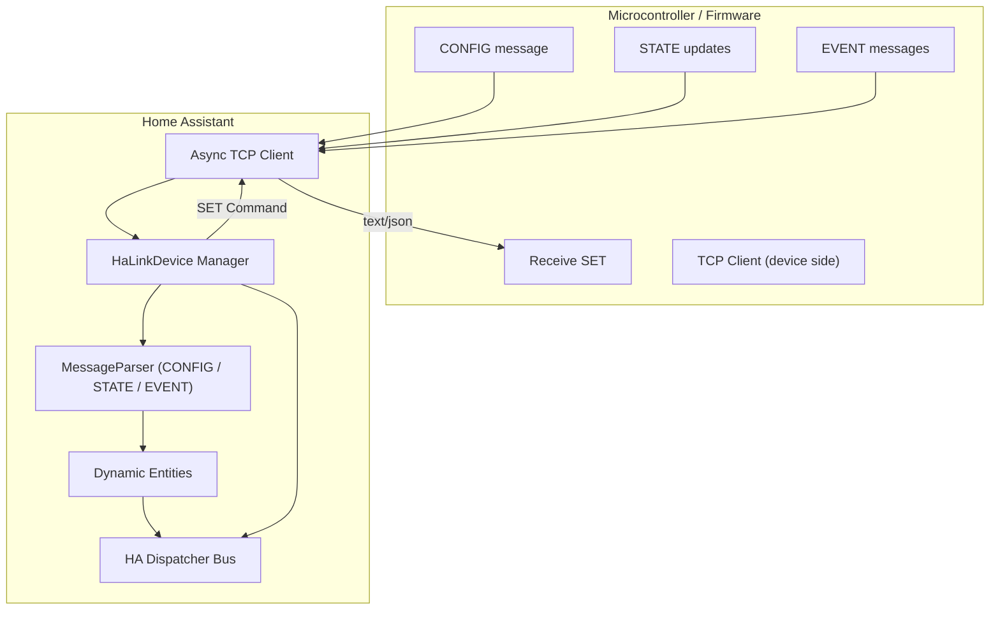
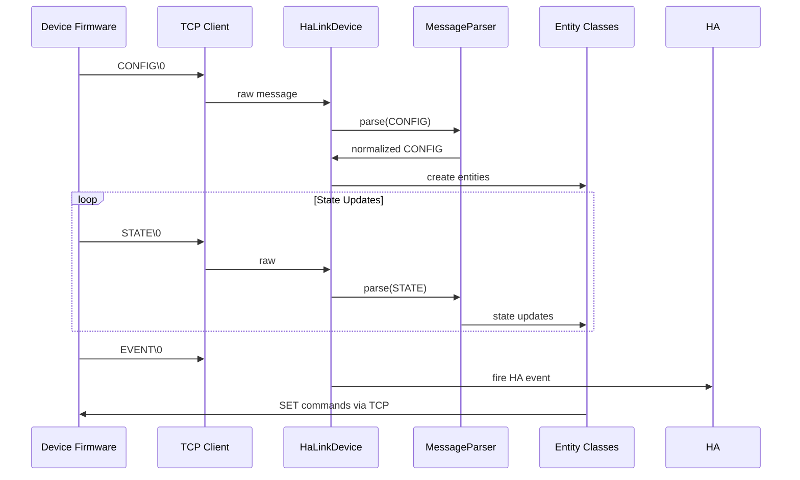

# 📘 **HaLink V3 – Home Assistant Integration & Protocol (Developer Handbook)**

*A lightweight, deterministic, TCP-based IoT protocol and HA integration designed for microcontrollers.*

---

## 🌟 Introduction

**HaLink** is an ultra-lightweight, deterministic, fully offline **local TCP protocol** designed specifically for microcontroller devices (ESP32, STM32, RP2040, etc.).
It provides:

* High-speed, low-latency bidirectional communication
* Human-friendly JSON messages
* Optional ultra-compact short-key mode
* Deterministic SET command behavior
* Built-in alive/connection monitoring
* Dynamic runtime entity creation in Home Assistant
* Zero YAML configuration

Unlike MQTT or REST, HaLink does not require brokers, discovery messages, retained topics, polling, or complex setup.
Everything happens through a small TCP socket and simple JSON messages.

This repository contains:

1. **Full Home Assistant integration**
2. **Complete protocol implementation**
3. **Firmware examples**
4. **The officially supported HaLink V3 protocol**

---

## 🧭 Protocol Philosophy & Goals

HaLink V3 was designed with specific objectives:

### ✔ **1. MCU-first architecture**

Firmware should be trivial to implement on any device:

* send a CONFIG once
* send STATE whenever values change
* send EVENT when needed
* react to SET commands
* everything over a single TCP connection

### ✔ **2. Offline, deterministic control**

No cloud, no broker, no discovery…
A device must work even without internet.
SET commands must always reach the target deterministically.

### ✔ **3. Simple JSON, human-readable**

The protocol avoids complexity:

* JSON for CONFIG, STATE, EVENT
* light-mode `key=value` for SET
* null-terminated (`\0`) messages for stream framing

### ✔ **4. Dynamic entity model**

Entities are defined **at runtime by firmware**, not by HA:

* sensors
* numbers
* switches
* select boxes
* binary sensors
* buttons
* * automatic connectivity sensor (Alive)

### ✔ **5. Short-key encoding**

Devices may send extremely compact messages using short-keys:

```
c: { v:3, s:{ rt:{u:"C"} } }
```

The integration transparently expands them into full JSON objects.

### ✔ **6. Predictable SET queue**

* configurable delay between SET frames
* 10-minute TTL
* optional timestamped SET in object mode

---

## 🏗 Architecture Overview

The HaLink system consists of the following major components:



---

## 🚀 Features at a Glance

* Fully async TCP engine with reconnect + keepalive
* Dynamic entity creation (CONFIG-driven)
* Per-entity STATE dispatch
* Event propagation → HA event bus
* SET command engine (light mode / object mode)
* SET queue + TTL
* Full short-key support
* OS-level TCP keepalive + fallback ping
* Auto-created `binary_sensor.<device>_alive`

---

## 📦 Installation (Home Assistant)

1. Copy this folder to:
   `config/custom_components/halink/`
2. Restart Home Assistant
3. Open **Settings → Devices & Services → Add Integration**
4. Search for **HaLink Device**
5. Enter:

   * Host
   * Port
   * Friendly name

That's it — entities will appear automatically when the device sends CONFIG.

---

# 🔧 Protocol Overview (HaLink V3)

## 1. CONFIG Message

Sent once at connection (and may be resent any time).

Defines:

* device metadata
* base/default attributes
* platforms (sensor, number, switch, binary_sensor, select, button)
* entity metadata
* set_mode
* delay_ms
* timestamp mode
* alive diagnostics

### Example:

```json
{
  "config": {
    "version": 3,
    "device": {
      "name": "Boiler Controller",
      "manufacturer": "ESP32"
    },
    "set_mode": "light",
    "delay_ms": 0,
    "sensor": {
      "Room Temperature": { "unit": "°C" },
      "Outer Temperature": { "unit": "°C" }
    },
    "switch": {
      "Heater": {}
    }
  }
}
```

---

## 2. STATE Message

Partial updates allowed.

Two formats:

### Primitive:

```json
{
  "state": {
    "room_temperature": 22.1
  }
}
```

### Detailed:

```json
{
  "state": {
    "room_temperature": {
      "value": 22.1,
      "attributes": { "calibration": -0.4 },
      "ts": 1700000012
    }
  }
}
```

### Alive state:

```json
{
  "state": {
    "alive": {
      "value": "online",
      "attributes": { "uptime": 5566 }
    }
  }
}
```

---

## 3. SET Message (Home Assistant → Device)

### Light mode:

```
heater=1\0
override_temperature=23.5\0
```

### Object mode:

```json
{
  "set": {
    "override_temperature": { "value": 23.5, "ts": 1700000113 }
  }
}
```

---

## 4. EVENT Message

Does **not** require CONFIG.

```json
{ "event": "button1" }
```

or:

```json
{
  "event": {
    "rfid_reader": { "uid": "AA-11-22-33", "ts": 1700000094 }
  }
}
```

---

# 🧩 Home Assistant Integration Design



---

# 💻 Firmware Examples (all platforms)

All examples are directly usable as-is and follow the V3 protocol.

---

## 🟦 **ESP32 – Arduino (C++) – Full Working Firmware**

```cpp
#include <WiFi.h>
#include <WiFiClient.h>
#include <ArduinoJson.h>

WiFiClient client;

const char* ssid = "WIFI";
const char* pass = "PASS";
const char* host = "homeassistant.local";
const int   port = 5001;

void sendJson(const JsonDocument& doc) {
    String out;
    serializeJson(doc, out);
    out += '\0';
    client.print(out);
}

void sendConfig() {
    StaticJsonDocument<1024> d;

    auto cfg = d["config"].to<JsonObject>();
    cfg["version"] = 3;
    cfg["set_mode"] = "light";

    cfg["sensor"]["Room Temperature"]["unit"] = "°C";
    cfg["switch"]["Heater"] = JsonObject();

    sendJson(d);
}

void sendState(float t, int heater) {
    StaticJsonDocument<256> d;
    d["state"]["room_temperature"] = t;
    d["state"]["heater"] = heater;
    sendJson(d);
}

String rx;

void setup() {
    WiFi.begin(ssid, pass);
    while (WiFi.status() != WL_CONNECTED) delay(200);

    client.connect(host, port);
    sendConfig();
}

void loop() {
    // Read SET commands
    while (client.available()) {
        char c = client.read();
        if (c == '\0') {               // finished frame
            if (rx.indexOf('=') != -1) {
                int sep = rx.indexOf('=');
                String key = rx.substring(0, sep);
                String val = rx.substring(sep + 1);
                Serial.printf("SET: %s=%s\n", key.c_str(), val.c_str());
            }
            rx = "";
        } else {
            rx += c;
        }
    }

    sendState(21.4, 1);
    delay(5000);
}
```

---

## 🟩 **ESP-IDF (C)**

```c
static void halink_send(const char *msg) {
    send(sock, msg, strlen(msg), 0);
    send(sock, "\0", 1, 0);
}

static void send_config() {
    halink_send("{\"config\":{\"version\":3,\"sensor\":{\"Temp\":{\"u\":\"C\"}}}}");
}
```

---

## 🟧 **MicroPython (ESP32/Pico W)**

```python
import ujson, socket, time

s = socket.socket()
s.connect(("homeassistant.local", 5001))

def send(obj):
    raw = ujson.dumps(obj) + '\0'
    s.send(raw.encode())

send({
  "config": {
    "version": 3,
    "sensor": { "Room Temperature": {"unit": "C"} }
  }
})

while True:
    send({ "state": {"room_temperature": 21.7} })
    time.sleep(5)
```

---

## 🟥 **STM32 (LWIP netconn)**

```c
void send_state(struct netconn *conn, float t) {
    char buf[128];
    sprintf(buf, "{\"state\":{\"temp\":%.2f}}\0", t);
    netconn_write(conn, buf, strlen(buf), NETCONN_COPY);
}
```

---

# 📚 Full Protocol Specification

The full text is included in:
📄 `halink_v3_specification.txt`

---

# 🤝 Contributing

Pull requests are welcome — firmware examples, optimizations, protocol extensions, documentation improvements.

---

# 📜 License

MIT License.

---
