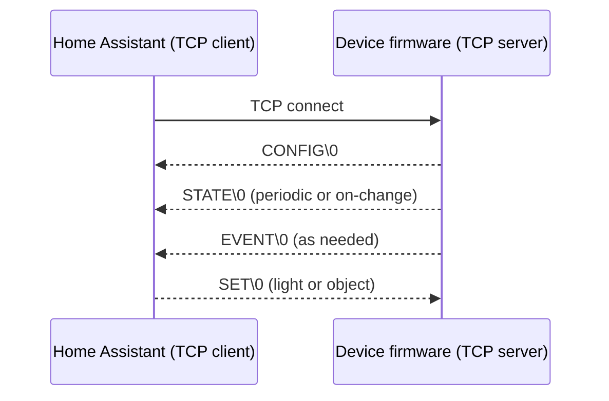
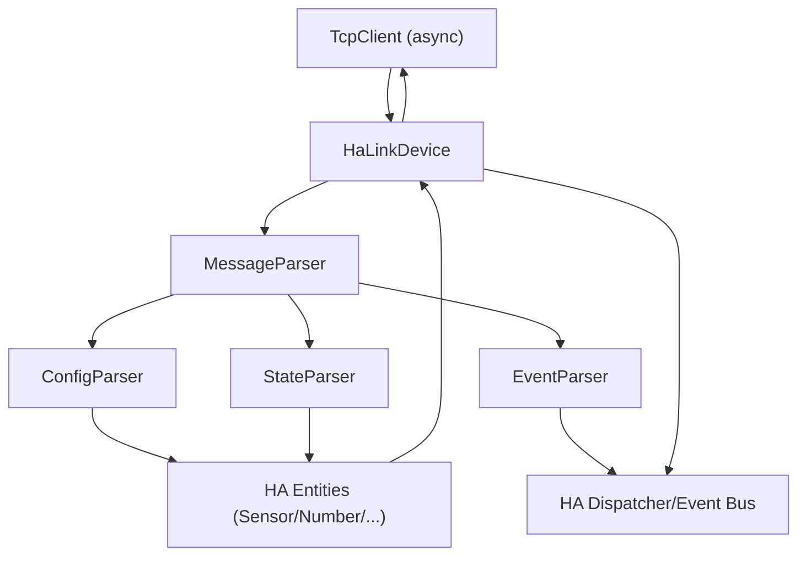

# HaLink V3 — Home Assistant Integration & Protocol

**Lightweight • Deterministic • Local TCP IoT Protocol** for microcontrollers and servers.

*A fast, broker-free, fully offline protocol with native Home Assistant integration.*


[](https://opensource.org/licenses/MIT)

---

## What is HaLink?

**HaLink V3** is a lightweight, TCP-based IoT protocol designed for microcontrollers (ESP32, ESP8266, STM32, RP2040, AVR, etc.) and server-side applications.  

It enables **direct, fast and deterministic** communication between your device and Home Assistant without MQTT, cloud services, or any broker.

### Key Advantages
- Device acts as TCP server, Home Assistant as client
- Dynamic entities defined entirely by your firmware via CONFIG
- Supports both ultra-compact `key=value` and full JSON commands
- Optional short-key compression for bandwidth-constrained devices
- Automatic entity creation and real-time state updates
- Built-in Alive connectivity sensor
- Excellent for both tiny MCUs and server-side scripts

---

## Installation

### Recommended: Install via HACS

1. Go to **HACS → Integrations**
2. Click the three dots (⋮) in the top right → **Custom repositories**
3. Add repository: https://github.com/jzolee/HaLink
4. Select **Integration** as category
5. Click **Add**
6. Search for **HaLink Device** and install it
7. Restart Home Assistant
8. Go to **Settings → Devices & Services → Add Integration** → search for **HaLink Device**

### Manual Installation

1. Copy the `custom_components/halink/` folder into your Home Assistant `config/custom_components/` directory
2. Restart Home Assistant
3. Add the integration via **Settings → Devices & Services**

Entities will appear automatically after your device sends a valid CONFIG message.

---

## Quick Start for Developers

1. Open a TCP server on your device (default port: 5000)
2. When Home Assistant connects, send a **CONFIG** message (null-terminated)
3. Send **STATE** messages periodically or on change
4. Accept **SET** commands from HA
5. Optionally send **EVENT** messages (button presses, RFID, etc.)

All frames must end with a null byte (`\0`).

---

## Protocol Overview (V3)

All messages are JSON and **null-terminated** (`\0`).

### CONFIG (Device → HA)
- Must include `"version": 3`
- Defines entities, device metadata, and SET behavior (`set_mode`, `ts_enable`, `delay_ms`)
- Sent after connect and can be resent anytime

### STATE (Device → HA)
- Carries entity values
- Supports primitive values and rich objects (`value`, `attributes`, `ts`)
- Partial updates allowed

### SET (HA → Device)
- **Light mode**: `key=value\0`
- **Object mode**: `{"set": {"key": {"value": ..., "ts": ...}}}`
- Optional queue with `delay_ms` and 10-minute TTL

### EVENT (Device → HA)
- Independent events (button press, RFID, etc.)
- Appears in HA as `halink_event.<device_id>.<event_key>`

**Short-key mode** is optional and automatically expanded by the integration.

---

## Features

- Fully async TCP client with reconnect, backoff and OS-level keepalive
- CONFIG-driven dynamic entity creation
- Per-entity state updates via dispatcher
- EVENT propagation to Home Assistant event bus
- SET command queue with delay and TTL
- Automatic Alive connectivity binary sensor
- Supported platforms: sensor, number, switch, binary_sensor, select, button

---

## Design Goals & Philosophy

HaLink V3 was designed with MCU firmware in mind:

1. **MCU‑first implementation**
   - Firmware architecture should remain tiny and readable.
   - No mandatory JSON libraries required (you may build JSON strings manually).

2. **Offline, deterministic control**
   - HA connects directly to the device on your LAN.
   - No internet dependency.
   - SET behavior is predictable and configurable.

3. **Human‑friendly protocol**
   - CONFIG / STATE / EVENT are JSON objects.
   - SET supports both JSON object mode and ultra‑light `key=value` mode.
   - All frames are terminated with `\0` (null byte) for robust stream framing.

4. **Dynamic entity model**
   - Entities are not predeclared in HA.
   - Firmware tells HA what exists and how it behaves through CONFIG.
   - HA creates entities automatically.

5. **Compact short‑key mode**
   - Optional “ultra‑compact” mapping for bandwidth‑constrained devices.
   - HA expands keys transparently.

---

## Architecture Overview

### Roles
- **Device / Firmware:** TCP **server** (listens, accepts HA connection).
- **Home Assistant:** TCP **client** (connects, reconnects, receives messages, sends SET).

### Message flow


```mermaid
sequenceDiagram
    participant HA as Home Assistant (TCP client)
    participant MCU as Device firmware (TCP server)

    HA->>MCU: TCP connect
    MCU-->>HA: CONFIG\0
    MCU-->>HA: STATE\0 (periodic or on-change)
    MCU-->>HA: EVENT\0 (as needed)
    HA-->>MCU: SET\0 (light or object)
```

### Integration internals (high level)


```mermaid
flowchart TD
    HA_TCP["TcpClient (async)"]
    DEV["HaLinkDevice"]
    MP["MessageParser"]
    CP["ConfigParser"]
    SP["StateParser"]
    EP["EventParser"]
    ENT["HA Entities (Sensor/Number/...)"]
    BUS["HA Dispatcher/Event Bus"]

    HA_TCP --> DEV --> MP
    MP --> CP --> ENT
    MP --> SP --> ENT
    MP --> EP --> BUS
    DEV --> BUS
    ENT --> DEV --> HA_TCP
```

---

## Protocol Summary (V3)

All frames are **null‑terminated**: each JSON or text frame ends with `\0`.

### CONFIG (Device → HA)

Defines:
- protocol version (must be 3)
- device metadata (optional)
- base / platform / entity attributes (optional)
- entities grouped by platform
- SET behavior (`set_mode`, `ts_enable`, `delay_ms`)

CONFIG is sent:
- right after HA connects
- and can be resent anytime for reconfiguration

**CONFIG contains no state values.**

---

### STATE (Device → HA)

Carries runtime values.
Partial updates are allowed.

Two formats:
1) primitive
2) object with attributes and optional timestamp

---

### SET (HA → Device)

Two modes selected by CONFIG:

- **light mode**: plain text `key=value\0`
- **object mode**: JSON object

If `delay_ms > 0`, HA queues SET commands and sends them with spacing.
Queued commands expire after 10 minutes.

---

### EVENT (Device → HA)

Arbitrary events independent from CONFIG.
Examples: button presses, RFID reads, one‑shot interrupts.

Events appear in HA as:

`halink_event.<device_id>.<event_key>`

---

## Firmware Example (ESP32 AsyncTCP Server, no JSON library)

This example runs a TCP **server** on the device.
Home Assistant connects to it.

- Sends CONFIG on client connect
- Sends STATE every 5 seconds
- Accepts SET in **light mode** (`key=value`)
- Minimal optional detection of object mode without a JSON library
- Uses `\0` to delimit frames

> **Important:** We do not use ArduinoJson or any JSON library.
> JSON is sent as raw strings.

```cpp
#include <WiFi.h>
#include <AsyncTCP.h>

// -------------------- WIFI --------------------
const char* ssid = "WIFI";
const char* pass = "PASS";

// -------------------- HALINK -------------------
const uint16_t HALINK_PORT = 5001;
AsyncServer server(HALINK_PORT);
AsyncClient* haClient = nullptr;

String rxBuf;

// demo states
float roomTemp = 21.5;
float outerTemp = 4.2;
bool heaterOn = false;
unsigned long lastStateMs = 0;

// null-terminated send
void sendFrame(const String& payload) {
  if (!haClient || !haClient->connected()) return;
  String out = payload;
  out += '\0';
  haClient->write(out.c_str(), out.length());
}

// CONFIG (raw JSON string)
void sendConfigV3() {
  String cfg =
    "{"
      "\"config\":{"
        "\"version\":3,"
        "\"device\":{"
          "\"name\":\"Boiler Controller\","
          "\"manufacturer\":\"ESP32 DIY\","
          "\"model\":\"HaLink-AsyncTCP\","
          "\"sw_version\":\"1.0\""
        "},"
        "\"set_mode\":\"light\","
        "\"delay_ms\":0,"

        "\"base\":{"
          "\"*\":{"
            "\"ic\":\"mdi:chip\""
          "},"
          "\"sensor\":{"
            "\"sc\":\"measurement\""
          "}"
        "},"

        "\"sensor\":{"
          "\"Room Temperature\":{\"u\":\"°C\",\"dc\":\"temperature\",\"ic\":\"mdi:home-thermometer\"},"
          "\"Outer Temperature\":{\"u\":\"°C\",\"dc\":\"temperature\"},"
          "\"Forward Temperature\":{\"u\":\"°C\",\"dc\":\"temperature\"}"
        "},"

        "\"switch\":{"
          "\"Heater\":{\"ic\":\"mdi:fire\"}"
        "},"

        "\"binary_sensor\":{"
          "\"Gas Valve\":{\"dc\":\"gas\"},"
          "\"Pump\":{\"dc\":\"running\"}"
        "},"

        "\"number\":{"
          "\"Override Temp\":{\"mn\":16,\"mx\":26,\"st\":0.1,\"u\":\"°C\",\"dc\":\"temperature\"}"
        "},"

        "\"select\":{"
          "\"Operating Mode\":{"
            "\"opt\":[\"auto\",\"manual\",\"boost\",\"off\"],"
            "\"def\":\"auto\","
            "\"ec\":\"config\""
          "}"
        "},"

        "\"button\":{"
          "\"Restart Device\":{\"dc\":\"restart\",\"pv\":\"restart\",\"ec\":\"config\"}"
        "}"
      "}"
    "}";

  sendFrame(cfg);
}

// STATE (raw JSON string)
void sendStateV3() {
  String st =
    "{"
      "\"state\":{"
        "\"alive\":{"
          "\"value\":\"online\","
          "\"attributes\":{\"uptime\":" + String(millis()/1000) + "}"
        "},"
        "\"room_temperature\":" + String(roomTemp, 1) + ","
        "\"outer_temperature\":" + String(outerTemp, 1) + ","
        "\"forward_temperature\":{"
          "\"value\": " + String(roomTemp + 10.0, 1) + ","
          "\"attributes\": {\"source\":\"calc\"}"
        "},"
        "\"heater\":" + String(heaterOn ? 1 : 0) + ","
        "\"gas_valve\":1,"
        "\"pump\":0,"
        "\"override_temp\":{"
          "\"value\":22.0,"
          "\"ts\":" + String(millis()/1000) +
        "}"
      "}"
    "}";

  sendFrame(st);
}

// Light SET parser: key=value
void handleSetLight(const String& frame) {
  int eq = frame.indexOf('=');
  if (eq < 1) return;

  String key = frame.substring(0, eq);
  String val = frame.substring(eq + 1);

  key.trim(); val.trim();

  Serial.printf("[SET light] %s=%s\n", key.c_str(), val.c_str());

  if (key == "heater") {
    heaterOn = (val.toInt() != 0);
  }
  else if (key == "override_temp") {
    float t = val.toFloat();
    Serial.printf("Override temp -> %.2f\n", t);
  }
  else if (key == "operating_mode") {
    Serial.printf("Mode -> %s\n", val.c_str());
  }
}

// Very minimal object SET detection (no JSON library)
void handleSetObjectMinimal(const String& frame) {
  if (!frame.startsWith("{")) return;
  if (frame.indexOf("\"set\"") < 0) return;
  Serial.println("[SET object] raw:");
  Serial.println(frame);

  int k1 = frame.indexOf("\"override_temp\"");
  if (k1 >= 0) {
    int vpos = frame.indexOf("\"value\"", k1);
    if (vpos >= 0) {
      int colon = frame.indexOf(':', vpos);
      int end = frame.indexOf('}', colon);
      String vstr = frame.substring(colon + 1, end);
      vstr.trim();
      float val = vstr.toFloat();
      Serial.printf("override_temp value=%.2f\n", val);
    }
  }
}

void handleFrame(const String& frame) {
  if (frame.length() == 0) return;
  if (frame.startsWith("{")) handleSetObjectMinimal(frame);
  else handleSetLight(frame);
}

void onData(void* arg, AsyncClient* c, void* data, size_t len) {
  uint8_t* bytes = (uint8_t*)data;
  for (size_t i = 0; i < len; i++) {
    char ch = (char)bytes[i];
    if (ch == '\0') {
      String frame = rxBuf;
      rxBuf = "";
      handleFrame(frame);
    } else {
      rxBuf += ch;
      if (rxBuf.length() > 2048) rxBuf = ""; // safety limit
    }
  }
}

void onDisconnect(void* arg, AsyncClient* c) {
  Serial.println("HA disconnected");
  haClient = nullptr;
  rxBuf = "";
}

void onConnect(AsyncClient* c) {
  Serial.println("HA connected!");
  haClient = c;

  haClient->onData(&onData, nullptr);
  haClient->onDisconnect(&onDisconnect, nullptr);

  sendConfigV3();  // handshake
  sendStateV3();   // initial state
}

void setup() {
  Serial.begin(115200);

  WiFi.begin(ssid, pass);
  while (WiFi.status() != WL_CONNECTED) delay(200);

  server.onClient([](void* arg, AsyncClient* c) {
    if (haClient && haClient->connected()) {
      c->close(true);
      delete c;
      return;
    }
    onConnect(c);
  }, nullptr);

  server.begin();
  Serial.printf("HaLink TCP server listening on port %u\n", HALINK_PORT);
}

void loop() {
  if (haClient && haClient->connected()) {
    if (millis() - lastStateMs > 5000) {
      sendStateV3();
      lastStateMs = millis();
    }
  }
}
```

---

## CONFIG Examples

### Minimal CONFIG (single sensor)

```json
{
  "config": {
    "version": 3,
    "sensor": {
      "Room Temperature": { "unit": "°C" }
    }
  }
}
```

---

### Ultra‑compact short‑key CONFIG

```json
{
  "c": {
    "v": 3,
    "s": {
      "Room Temperature": { "u": "°C", "dc": "temperature" }
    },
    "sw": {
      "Heater": {}
    }
  }
}
```

---

### Base inheritance (global + platform)

```json
{
  "config": {
    "version": 3,
    "base": {
      "*": { "ic": "mdi:chip" },
      "sensor": { "sc": "measurement" }
    },
    "sensor": {
      "Room Temperature": { "u": "°C" },
      "Outer Temperature": { "u": "°C" }
    }
  }
}
```

---

### Number with limits and step

```json
{
  "config": {
    "version": 3,
    "number": {
      "Override Temp": {
        "unit": "°C",
        "min": 16,
        "max": 26,
        "step": 0.1
      }
    }
  }
}
```

---

### Select with options + default

```json
{
  "config": {
    "version": 3,
    "select": {
      "Operating Mode": {
        "options": ["auto", "manual", "boost", "off"],
        "default": "auto",
        "entity_category": "config"
      }
    }
  }
}
```

---

### Button with press_value

```json
{
  "config": {
    "version": 3,
    "button": {
      "Restart Device": {
        "device_class": "restart",
        "press_value": "restart",
        "entity_category": "config"
      }
    }
  }
}
```

---

### Device metadata for HA device registry

```json
{
  "config": {
    "version": 3,
    "device": {
      "name": "Boiler Controller",
      "manufacturer": "DIY",
      "model": "v3-proto",
      "sw_version": "2.4"
    },
    "sensor": {
      "Room Temperature": { "unit": "°C" }
    }
  }
}
```

---

### Object SET mode + timestamps + queued SET

```json
{
  "config": {
    "version": 3,
    "set_mode": "object",
    "ts_enable": true,
    "delay_ms": 200,
    "number": {
      "Override Temp": { "min": 16, "max": 26, "step": 0.1 }
    }
  }
}
```
### Full-featured CONFIG (Object SET mode)

```json
{
  "config": {
    "version": 3,
    "device": {
      "name": "Boiler Controller",
      "manufacturer": "DIY",
      "model": "HaLink-v3"
    },
    "set_mode": "object",
    "ts_enable": true,
    "delay_ms": 150,
    "select": {
      "Operating Mode": {
        "options": ["auto", "manual", "boost", "off"],
        "default": "auto",
        "entity_category": "config"
      }
    }
  }
}
```

---

## STATE Examples

### Minimal STATE (single value)

```json
{
  "state": {
    "room_temperature": 21.8
  }
}
```

---

### Multiple primitive values

```json
{
  "state": {
    "room_temperature": 21.8,
    "outer_temperature": 3.9,
    "heater": 1
  }
}
```

---

### Object form with attributes

```json
{
  "state": {
    "room_temperature": {
      "value": 21.8,
      "attributes": { "calibration": -0.4 }
    }
  }
}
```

---

### Attribute‑only update (no value)

```json
{
  "state": {
    "room_temperature": {
      "attributes": { "sensor_ok": true }
    }
  }
}
```

---

### Partial STATE (only changed key)

```json
{
  "state": {
    "heater": 0
  }
}
```

---

### Select current option

```json
{
  "state": {
    "operating_mode": "boost"
  }
}
```

---

### Select dynamic options update via STATE

```json
{
  "state": {
    "operating_mode": {
      "value": "manual",
      "options": ["auto", "manual", "off"]
    }
  }
}
```

---

### Timestamped STATE value

```json
{
  "state": {
    "override_temp": {
      "value": 22.5,
      "ts": 1700000456
    }
  }
}
```

---

## Troubleshooting

**Entities don't appear?**  
→ Ensure your device sends a valid CONFIG with `"version": 3` and ends with `\0`.

**Frequent disconnects?**  
→ Check network stability, firewall, and consider implementing keepalive pings.

**Can I run this on a server/PC?**  
→ Yes — any TCP server that sends proper JSON works perfectly.

**Duplicate device?**  
→ Protected by unique ID based on host:port.

---

## Known Limitations

- One integration per host:port pair
- No reconfigure flow yet (change host/port → remove and re-add)
- SET commands older than 10 minutes are dropped
- Short keys are optional but recommended for small MCUs

---

## Contributing

Contributions welcome:
- More firmware examples (STM32, RP2040, Python server, etc.)
- Protocol extensions
- Documentation improvements
- Bug reports and testing

---

## License

MIT License.
